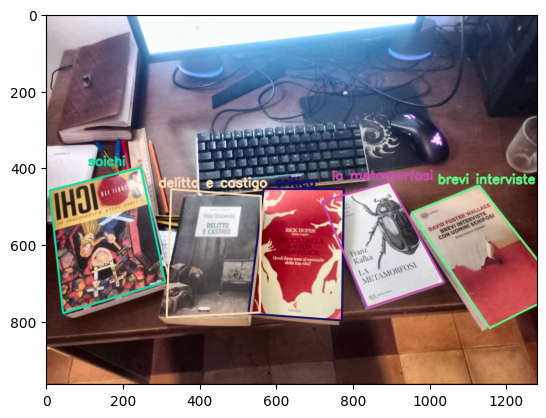

# Multi-Object Detection with SIFT, FLANN, and Homography

This project is a Python command-line application that searches for multiple
objects within one or more photographs.

The user provides two folders:

- a folder containing **reference images**, with one image for each object to
  be recognized;
- a folder containing **scene images**, with the photographs in which those
  objects should be searched for.

The program automatically compares every reference image against every scene,
locates the recognized objects, and saves a new version of each scene with
bounding boxes and labels.

One possible use case is recognizing books placed on a desk: the reference
folder contains images of the individual book covers, while the scene folder
contains photographs of the desk. The result is a copy of each scene in which
every recognized book is highlighted with its name.

## Example output

<p align="center">
  
</p>

---

## How it works

The project uses classical computer vision techniques and does not require any
training.

For every reference image, distinctive keypoints and descriptors are extracted
using **SIFT**. The same descriptors are computed for each scene and compared
using **FLANN**.

The comparison produces many candidate matches. The **Lowe ratio test**
removes ambiguous ones, keeping only correspondences for which the best match
is clearly more convincing than the second-best match.

When enough correspondences remain, the program attempts to estimate a
homography using **RANSAC**. The homography describes the perspective
transformation that maps the reference image to its location inside the scene.
The four corners of the reference image are then projected onto the scene to
build the bounding box.

Multi-object detection is performed in several steps:

1. all reference images are searched for in the scene;
2. overlapping detections are filtered;
3. detected objects are masked;
4. the search is repeated on the modified scene.

This makes it possible to find both different objects and multiple instances of
the same object.

The approach works particularly well with detailed and approximately planar
objects, such as:

- book covers;
- product packages;
- posters;
- labels;
- documents;
- logos and products with recognizable textures.

It may be less effective with uniform surfaces, strongly deformable objects,
very blurred images, extremely small objects, or extreme viewpoint changes.

---

# Dataset preparation

A typical folder structure is:

```text
dataset/
├── references/
│   ├── delitto_e_castigo.jpg
│   ├── la_metamorfosi.png
│   ├── brevi_interviste.jpeg
│   └── ...
└── scenes/
    ├── scrivania_01.jpg
    ├── scrivania_02.jpg
    └── ...
```

The reference filename is used as the detection label. The file extension is
removed and underscores are converted into spaces:

```text
delitto_e_castigo.jpg
```

becomes:

```text
delitto e castigo
```

The files do not need to be numbered.

The following formats are supported:

```text
.png  .jpg  .jpeg  .bmp  .tif  .tiff  .webp
```

Images must be stored directly inside the specified folders. Subfolders are not
searched recursively.

---

# Installation

The project requires Python 3.10 or later.

Open a terminal in the project root directory, which contains `detect.py`,
`requirements.txt`, `pyproject.toml`, and the `src` folder.

Using a virtual environment is recommended.

## Windows PowerShell

```powershell
py -m venv .venv
.venv\Scripts\Activate.ps1
py -m pip install --upgrade pip
py -m pip install -r requirements.txt
```

## Windows Command Prompt

```bat
py -m venv .venv
.venv\Scripts\activate.bat
py -m pip install --upgrade pip
py -m pip install -r requirements.txt
```

## macOS and Linux

```bash
python3 -m venv .venv
source .venv/bin/activate
python3 -m pip install --upgrade pip
python3 -m pip install -r requirements.txt
```

The main dependencies are OpenCV, NumPy, and Matplotlib.

---

# First run

The minimum command only requires the reference, scene, and output folders:

```bash
python detect.py \
  --references ./dataset/references \
  --scenes ./dataset/scenes \
  --output ./output
```

On Windows PowerShell, the same command can be written as:

```powershell
py detect.py `
  --references ".\dataset\references" `
  --scenes ".\dataset\scenes" `
  --output ".\output"
```

The program:

1. loads all reference images;
2. loads all scene images;
3. runs detection on every scene;
4. saves one annotated scene for every input image;
5. generates `detections.csv`.

The output will have a structure similar to:

```text
output/
├── scrivania_01_detected.png
├── scrivania_02_detected.png
└── detections.csv
```

A scene is still saved even when no object is detected.

---

# Usage examples

## 1. Standard run

```bash
python detect.py \
  --references ./dataset/references \
  --scenes ./dataset/scenes \
  --output ./output
```

This configuration uses:

- a cutoff of `40`;
- no preprocessing;
- a Lowe ratio of `0.7`;
- a RANSAC threshold of `5.0`;
- figure output with axes and coordinates.

This is the recommended starting point when the most suitable parameters for a
dataset are not yet known.

## 2. More permissive detection

If some real objects are not detected, the cutoff can be lowered:

```bash
python detect.py \
  --references ./dataset/references \
  --scenes ./dataset/scenes \
  --output ./output_cutoff_20 \
  --cutoff 20
```

With `--cutoff 20`, the program attempts to estimate a homography as soon as
20 good matches are available. This may recover small or difficult objects, but
it can also increase false positives.

The cutoff should not be lowered blindly. The debug mode described below shows
how many matches are actually produced.

## 3. Low-contrast scenes

When reference images are sharp but scene images have uneven lighting or low
contrast, CLAHE preprocessing can be tested:

```bash
python detect.py \
  --references ./dataset/references \
  --scenes ./dataset/scenes \
  --output ./output_clahe \
  --preprocess clahe
```

CLAHE is applied only to the copy of the scene used for detection. The
annotated output is always generated from the original scene.

CLAHE does not necessarily improve every dataset. It is useful to compare the
results obtained with and without preprocessing.

## 4. Analyzing matches before choosing the cutoff

```bash
python detect.py \
  --references ./dataset/references \
  --scenes ./dataset/scenes \
  --output ./output_debug \
  --debug-matches
```

In addition to the annotated images and `detections.csv`, the program creates:

```text
match_debug.csv
```

This file contains the number of keypoints and good matches for every
reference-scene pair.

A possible calibration workflow is:

1. run the program with `--debug-matches`;
2. open `match_debug.csv`;
3. observe how many matches are produced by correct pairs;
4. observe how many matches are produced by incorrect pairs;
5. choose a cutoff that separates the two groups as clearly as possible.

For example, if reference images that are actually present produce between 28
and 70 matches, while absent references almost always remain below 12, a cutoff
between 18 and 25 may be a reasonable starting point.

## 5. Saving a figure like the one displayed in the notebook

```bash
python detect.py \
  --references ./dataset/references \
  --scenes ./dataset/scenes \
  --output ./output \
  --render-mode figure \
  --figure-dpi 200
```

The `figure` mode saves:

- the complete scene;
- bounding boxes and labels;
- margins;
- axes and pixel coordinates.

`--figure-dpi 200` increases image definition compared with the default value
of 150 DPI.

## 6. Saving only the annotated image

```bash
python detect.py \
  --references ./dataset/references \
  --scenes ./dataset/scenes \
  --output ./output_raw \
  --render-mode image
```

This mode does not add axes or margins. The resulting image preserves the
resolution of the original scene.

## 7. Complete configuration

```bash
python detect.py \
  --references ./dataset/references \
  --scenes ./dataset/scenes \
  --output ./output \
  --cutoff 25 \
  --preprocess none \
  --ratio 0.7 \
  --ransac-threshold 5.0 \
  --iou-threshold 0.5 \
  --max-iterations 50 \
  --debug-matches \
  --render-mode figure \
  --figure-dpi 180
```

This example explicitly includes every available option and can be used as a
starting point for a script or an automated pipeline.

---

# Command-line options

To display the option list directly from the program:

```bash
python detect.py --help
```

## `--references`

```bash
--references PATH
```

Required parameter. Specifies the folder containing the images of the objects
to be searched for.

Example:

```bash
--references ./dataset/references
```

All valid image files in the folder are loaded. SIFT features for the reference
images are computed once and reused for every scene.

## `--scenes`

```bash
--scenes PATH
```

Required parameter. Specifies the folder containing the images to be analyzed.

Example:

```bash
--scenes ./dataset/scenes
```

Each file produces a separate annotated scene.

## `--output`

```bash
--output PATH
```

Required parameter. Specifies the folder in which results and reports are
saved.

Example:

```bash
--output ./output
```

The folder is created automatically if it does not already exist.

## `--cutoff`

```bash
--cutoff N
```

Default value:

```text
40
```

Defines the minimum number of good matches required before attempting to
estimate a homography.

A low value makes the system more permissive:

```bash
--cutoff 15
```

This may help with small, partially visible, or low-detail objects, but it also
increases the risk of false positives.

A high value makes the system more selective:

```bash
--cutoff 60
```

This removes weak candidates but may miss objects that are actually present.

Exceeding the cutoff does not automatically produce a detection. The matches
must also be geometrically consistent and allow RANSAC to estimate a valid
homography.

## `--preprocess`

```bash
--preprocess none
```

or:

```bash
--preprocess clahe
```

Default value:

```text
none
```

`none` uses the scenes without modifying them.

`clahe` locally improves the contrast of the lightness channel. It may be
useful with shadows, uneven lighting, or low-contrast images.

Reference images are not preprocessed.

CLAHE is not always beneficial: on already sharp scenes, it may artificially
emphasize details and change the number of matches.

## `--ratio`

```bash
--ratio VALUE
```

Default value:

```text
0.7
```

This parameter controls the Lowe ratio test. For every descriptor, FLANN finds
the two nearest neighbors. The best match is accepted only when it is
sufficiently better than the second-best match.

A lower value is stricter:

```bash
--ratio 0.6
```

Fewer matches are retained, and they are generally more distinctive.

A higher value is more permissive:

```bash
--ratio 0.8
```

More matches are retained, but the probability of ambiguous correspondences
increases.

Practical ranges to test:

```text
0.60 - 0.65   very selective
0.70          recommended starting value
0.75 - 0.80   more permissive
```

`ratio` and `cutoff` should be tuned together. Increasing the ratio generally
produces more good matches and may therefore require a higher cutoff.

## `--ransac-threshold`

```bash
--ransac-threshold VALUE
```

Default value:

```text
5.0
```

This is the reprojection-error threshold, expressed in pixels, used while
estimating the homography.

With a low value:

```bash
--ransac-threshold 3.0
```

RANSAC accepts only points that are highly consistent with the estimated
transformation.

With a higher value:

```bash
--ransac-threshold 8.0
```

the estimation tolerates more noise and imprecision, but it may accept less
reliable correspondences.

In general, this parameter should be changed only after observing that the
matches appear plausible but the homography is often rejected or produces
unstable boxes.

## `--iou-threshold`

```bash
--iou-threshold VALUE
```

Default value:

```text
0.5
```

Controls when two bounding boxes are considered overlapping.

IoU, or Intersection over Union, measures the ratio between the overlapping
area and the combined area of the two boxes.

With a low value:

```bash
--iou-threshold 0.3
```

overlapping detections are removed more aggressively.

With a high value:

```bash
--iou-threshold 0.8
```

more nearby boxes may be retained.

If the same object is drawn multiple times in nearly the same position, lower
the threshold. If two real nearby objects are incorrectly merged, increasing
it may help.

## `--max-iterations`

```bash
--max-iterations N
```

Default value:

```text
50
```

Multi-object detection works iteratively. After every pass, detected objects
are masked and the search begins again.

The process stops when no additional object is found or when the specified
limit is reached.

A more conservative example is:

```bash
--max-iterations 15
```

A lower limit reduces the maximum processing time and protects against repeated
detections. A higher limit may be necessary for scenes containing many
instances.

## `--debug-matches`

```bash
--debug-matches
```

This is a flag and does not require a value.

When present, the program generates `match_debug.csv`.

For every reference-scene pair, the report contains:

- the number of reference keypoints;
- the number of scene keypoints;
- the number of good matches;
- whether the cutoff was passed.

This is the most useful option for understanding why an object was not detected
and for tuning `--cutoff` and `--ratio`.

The report describes the comparison against the original complete scene. It
does not describe every later iteration after masking.

## `--render-mode`

```bash
--render-mode figure
```

or:

```bash
--render-mode image
```

Default value:

```text
figure
```

`figure` uses Matplotlib and saves a representation similar to the notebook
output, including margins, axes, and coordinates.

`image` uses OpenCV and saves only the annotated raster image, without axes.
This mode is preferable when the output file will later be processed by another
program.

## `--figure-dpi`

```bash
--figure-dpi N
```

Default value:

```text
150
```

Controls the resolution of figures saved in `figure` mode.

Examples:

```text
100   smaller file
150   default value
200   sharper image
300   suitable for documents or printing, but larger
```

It has no effect when using:

```bash
--render-mode image
```

---

# Interpreting the results

## `detections.csv`

The file contains one row for every detected instance.

The main columns are:

- `scene`: scene filename;
- `reference`: name of the recognized object;
- `instance`: sequential number of the same object instance;
- `center_x`, `center_y`: center of the bounding box;
- `width_px`, `height_px`: approximate box dimensions in pixels;
- `good_matches`: matches that passed the Lowe ratio test;
- `ransac_inliers`: matches consistent with the homography.

The number of `ransac_inliers` is often more meaningful than the number of good
matches alone. For example, 35 good matches with 5 inliers are less convincing
than 22 good matches with 18 inliers.

## `match_debug.csv`

This file is created only when `--debug-matches` is enabled.

Its main purpose is to show the separation between references that are present
and references that are absent. If both categories produce similar values,
changing only the cutoff may not be enough: the reference images may need to be
improved, the ratio may need to be adjusted, or the quality of the scenes may
need to be checked.

---

# A practical calibration procedure

For a new dataset, a reasonable starting point is:

```bash
python detect.py \
  --references ./dataset/references \
  --scenes ./dataset/scenes \
  --output ./calibration_output \
  --cutoff 20 \
  --debug-matches \
  --render-mode figure
```